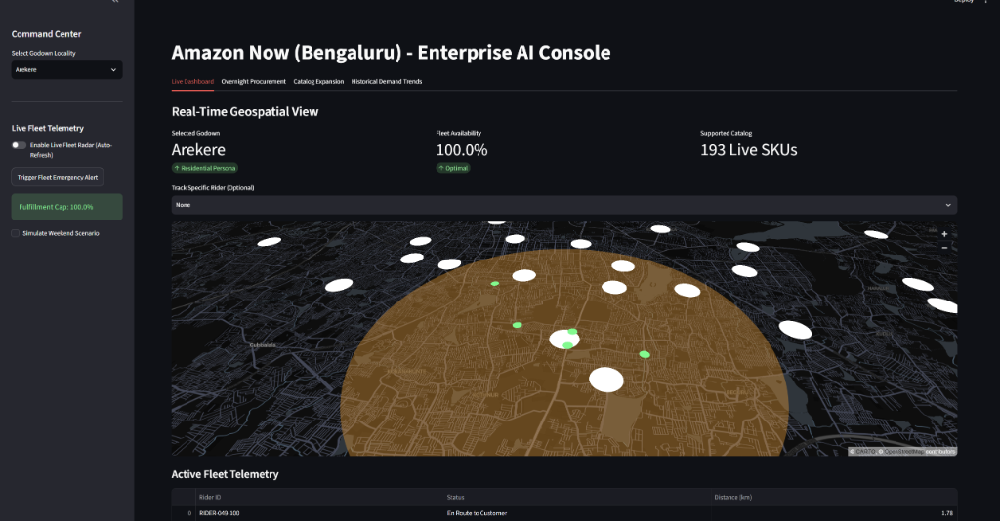
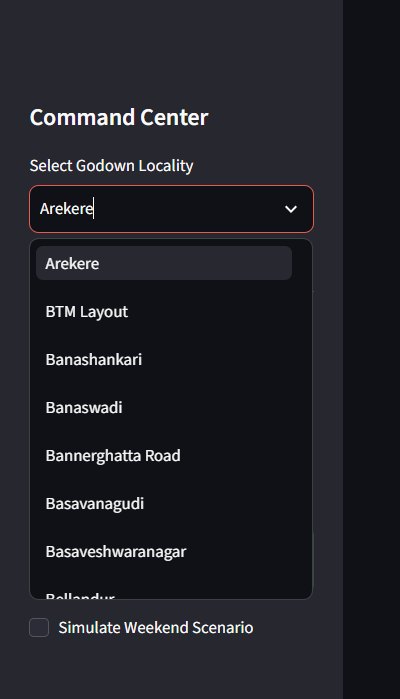
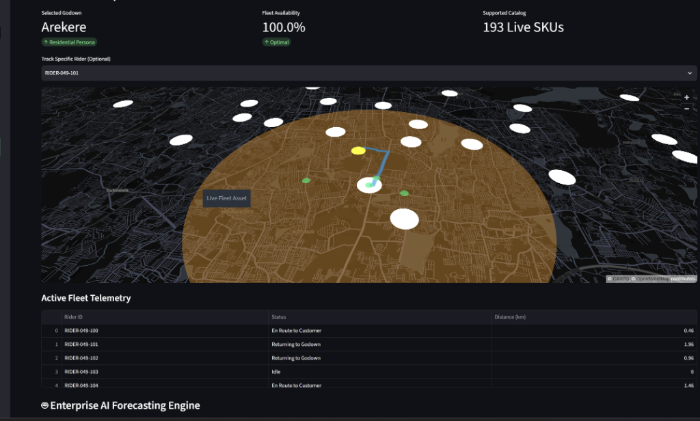
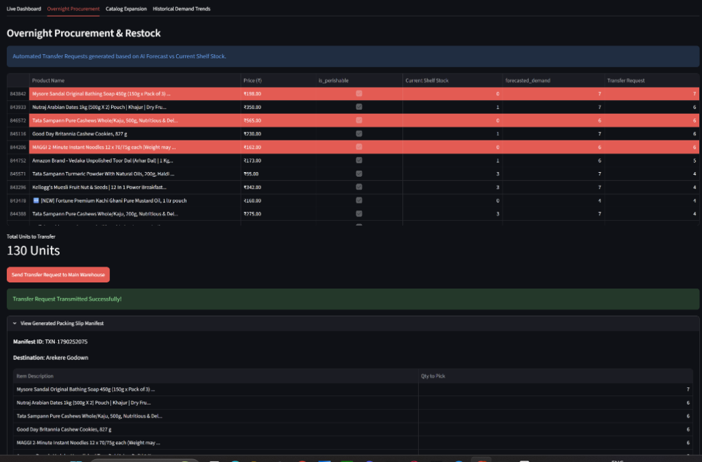
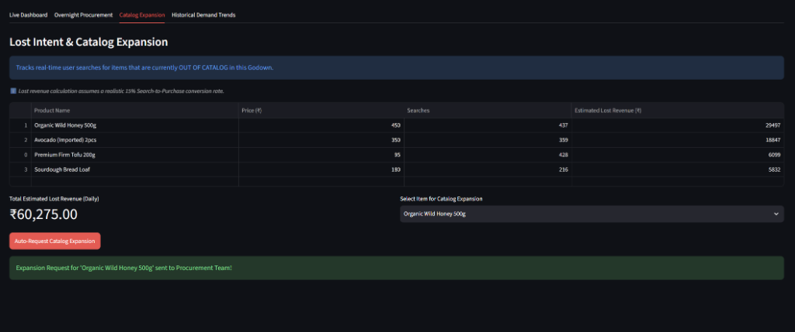
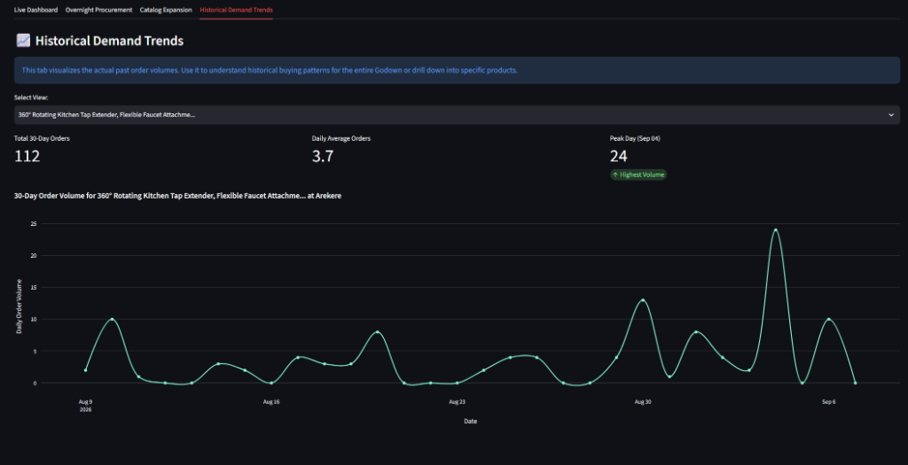

# Amazon Now Forecasting - Enterprise AI Console

This repository contains the **Amazon Now (Bengaluru) - Enterprise AI Console**, a prototype dashboard for predicting hyper-local demand, managing fleet routing, and optimizing overnight restocks. 

## Features & Detailed Purpose

### 1. Live Dashboard & Geospatial Fleet Radar

**Command Center - Godown Selection:**

**Active Fleet Telemetry & Rider Tracking:**

- **Purpose & Flow**: The Command Center allows managers to cycle through specific hyper-local Bengaluru godowns (e.g., Arekere, BTM Layout, Banashankari). Each godown has a tagged demographic "Persona" (like *Residential* or *IT Tech Park*) which heavily influences buying patterns. 
The geospatial radar provides a real-time, bird's-eye view of all godowns and tracks simulated riders delivering orders on real maps. The active fleet telemetry panel continuously streams the status of individual riders (e.g., *En Route to Customer*, *Returning to Godown*, *Idle*) alongside their remaining distance. It also dynamically calculates a "Fulfillment Cap" percentage based on live traffic congestion.
- **Why we used it (Free Tools)**: `PyDeck` (via Streamlit) is used for rendering interactive maps, and the `OSRM (Open Source Routing Machine) API` is used to fetch live traffic/routing data and exact polyline paths. OSRM is a completely free, open-source routing engine. 
- **Production Alternative**: In production, **Google Maps Platform (Routes API)** or **Mapbox** would be used for high-accuracy, enterprise-grade traffic and routing data, as OSRM public servers are not meant for high-scale commercial loads.

### 2. Enterprise AI Forecasting Engine (XGBoost) & Explainable AI

- **Purpose & Flow**: This engine predicts the exact next 24-hour demand for every single product at a specific godown to prevent out-of-stock scenarios. The UI highlights perishable items (like produce) and outputs upper and lower bound confidence intervals. 
Rather than treating the AI as a "black box," the **Explainable AI (XAI) Insights** graph explicitly visualizes the mathematical reasoning behind the AI's prediction. As seen in the chart, external macro factors like **Heavy Rain** and **Locality Demographics** carry the heaviest mathematical weight in driving demand spikes, rather than just historical lag features.
- **Why we used it (Free Tools)**: `XGBoost` is a highly efficient, open-source machine learning algorithm that is the industry standard for tabular data forecasting. We leveraged the native mathematical feature importance metrics built into XGBoost, rendering them beautifully using the free **Plotly Express** graphing library.
- **Production Alternative**: In a massive production environment, we would use managed services like **Amazon Forecast** or **AWS SageMaker** to train models across billions of rows distributed across GPU clusters. For advanced production XAI, libraries like **SHAP (SHapley Additive exPlanations)** would be integrated to provide row-level explanations.

### 3. Overnight Procurement & Restock Manifests

- **Purpose & Flow**: Automates the decision of what needs to be transferred from the main central warehouse to local godowns to meet tomorrow's demand. By mathematically comparing the AI's forecasted demand against current simulated shelf stock, it flags exact shortages, highlights critically out-of-stock items in red, and generates a fully actionable packing slip with a unique Manifest ID for the destination godown (e.g., Arekere).
- **Why we used it (Free Tools)**: Pure `Pandas` and `Streamlit` session state logic to securely manage and simulate inventory transfers on the fly.
- **Production Alternative**: This logic would be directly integrated via API into backend **ERP Systems (like SAP or Oracle)** or **AWS Supply Chain**, instantly triggering robotic pick-and-pack workflows on warehouse floors rather than just generating a CSV.

### 4. Lost Intent & Catalog Expansion

- **Purpose & Flow**: Simulates tracking when hyper-local customers search for items that aren't currently stocked at their specific godown (e.g., Organic Wild Honey or Imported Avocados in a residential zone). It calculates the daily estimated lost revenue based on a realistic 15% search-to-purchase conversion rate. Managers can select the highest-value missing items and click the "Auto-Request Catalog Expansion" button to immediately flag the item to the central Procurement Team.
- **Why we used it (Free Tools)**: Custom analytical logic simulating user search logs in `Pandas` mapped against godown personas. 
- **Production Alternative**: In production, real-time user search strings would stream live from **Elasticsearch** (search logs) through **Apache Kafka / AWS Kinesis** into a massive stream analytics engine to accurately quantify lost intent in real-time.

### 5. Historical Demand Trends

- **Purpose & Flow**: Visualizes the last 30 days of actual order volumes. Managers can review macro godown trends or drill deep into the historical cadence of specific products. The dashboard automatically calculates vital KPIs like Total 30-Day Orders, Daily Average Orders, and identifies the Peak Volume Day to spot cyclic buying patterns (like weekend spikes).
- **Why we used it (Free Tools)**: We utilized **Plotly Express** for highly fluid, interactive, and free time-series charting.
- **Production Alternative**: For visualizing petabytes of historical logs, massive data warehouses like **Snowflake** or **Amazon Redshift** would pipe data directly into enterprise BI dashboards like **Tableau**, **PowerBI**, or **Amazon QuickSight**.

## How to Run
1. Install dependencies: `pip install -r requirements.txt`
2. Run data generation: `python generate_data.py`
3. Run feature engineering: `python feature_engineering.py`
4. Train the model: `python model_training.py`
5. Start the dashboard: `start_dashboard.bat` or `streamlit run app.py`
